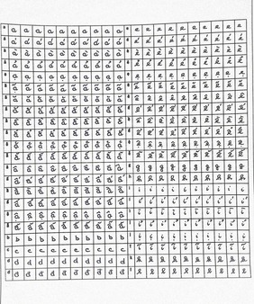

## ĐỀ TÀI: PHÂN LOẠI CHỮ VIẾT TAY BẰNG TIẾNG VIỆT
## LỚP: CS114.K21.KHCL AND CS114.K22.KHCL
## Giảng viên:
1. Lê Đình Duy
2. Phạm Nguyễn Trường An
## Thành viên:
1. Đỗ Trọng Khánh - 19521676
2. Võ Phạm Duy Đức - 19521383
3. Trịnh Công Danh - 19521326
## 1. Mô tả bài toán:
Nhận dạng chữ viết tay (Handwriting recognition - HWR) là khả năng máy tính nhận và giải thích dữ liệu chữ viết tay dễ hiểu từ các nguồn như tài liệu giấy, ảnh,....

- Input: Hình ảnh gồm 1 ký tự viết tay tiếng Việt.
- Output: Hình ảnh chữ cái tương ứng với input.

## 2. Mô tả về bộ dữ liệu:
  - Thu thập dữ liệu:
    - Dữ liệu là yếu tố quan trọng nhất và cũng là vấn đề mà chúng ta cần quan tâm nhất. Trong quá trình xây dựng một hệ thống phân loại chữ viết tay, bước chuẩn bị và tiền xử lý dữ liệu quyết định tới thành bại của hệ thống hơn cả.
    - Với bài toán phân loại chữ viết tay bằng tiếng việt, dữ liệu ban đầu mình cần chuẩn bị là những hình ảnh được viết bằng tay.
    - Bước tiếp theo, chúng ta sẽ tiến hành tiền xử lý dữ liệu trước khi đưa vào huấn luyện mô hình phân loại chữ viết tay. Việc tiền xử lý dữ liệu là hết sức quan trọng để đảm bảo mô hình đạt được kết quả tốt
    - Chia làm 2 tập train (X_train, y_train) và test (X_test, y_test) theo tỉ lệ 80% train, 20% test.

  - Cách thu thập dữ liệu:
    - Dữ liệu thu thập từ hơn 30 người tình nguyện tại thành phố Quảng Ngãi và Quảng Nam.
    - Nhóm sẽ gọp chung 30 mẫu dữ liệu với nhóm của bạn Đặng Văn Minh --> data train: là 60 mẫu, còn lại nhóm sẽ giữ để làm data test riêng cho nhóm.
    - Nhóm sẽ chuẩn bị sẵn các mầu tờ giấy và sẽ nhờ những tình nguyện viên viết những con chữ vào ô tờ giấy như **Hình 1**, sau đó nhóm sẽ đem scan thành những tấm hình như hình **Hình 2**

    **Hình 1: Mẫu thu thập dữ liệu** ----------------- **Hình 2: Ảnh đã được scan**

   

## 3. Ứng dụng:
  - Dùng để nhận diện 1 đoạn văn được viết bằng tay bằng tiếng việt và chuyển đoạn văn đó sang dạng text trên máy tính
